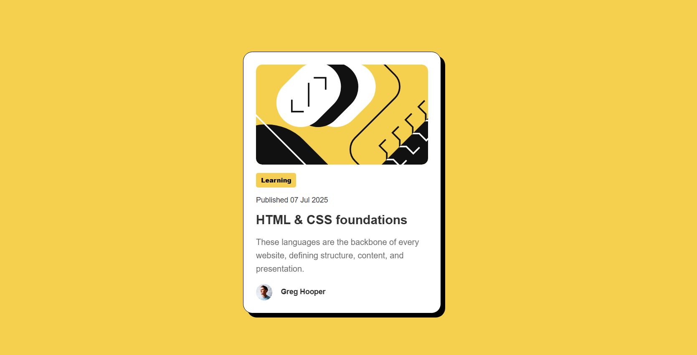

# Frontend Mentor - Blog preview card


## Welcome! 👋

Thanks for checking out this front-end coding challenge.

## Table of contents

- [Frontend Mentor - Blog preview card](#frontend-mentor---blog-preview-card)
  - [Welcome! 👋](#welcome-)
  - [Table of contents](#table-of-contents)
  - [Overview](#overview)
    - [The challenge](#the-challenge)
    - [Screenshot](#screenshot)
    - [Links](#links)
      - [My solution is here:](#my-solution-is-here)
  - [My process](#my-process)
    - [Built with](#built-with)
    - [What I learned](#what-i-learned)
  - [Author](#author)


## Overview

My challange was to recreate this card for Blog presentation. 

### The challenge

Users should be able to:

- See hover and focus states for all interactive elements on the page

### Screenshot




### Links

#### My solution is here: 
- Live Site URL: [Add live site URL here](https://jeff-nas.github.io/Mentor-beginner-blog-previw-card/)

## My process

### Built with

- Semantic HTML5 markup
- CSS custom properties
- Media Queries


### What I learned

I learned to use `tabindex="0"` to make an element that is not naturally focusable (like <div>, <span>, <li>, etc.) receive focus with Tab.
I also learned that when inserting an image into a container, it must have its height and width properties defined. Otherwise the image will try to fill 100% of the header height, but the header will automatically try to adapt to the image size. This creates an ineffective loop, and the image cropping never happens.


```html
<h1 `tabindex="0"`>Some HTML code I'm proud of</h1>
```
```css
.card>header {
    height: 12rem;
    overflow: hidden;
    border-radius: 12px;
}
```

## Author

- Frontend Mentor - [@yourusername](https://www.frontendmentor.io/profile/Jeff-Nas)
- Twitter - [@yourusername](https://x.com/Jeferso65230539)


